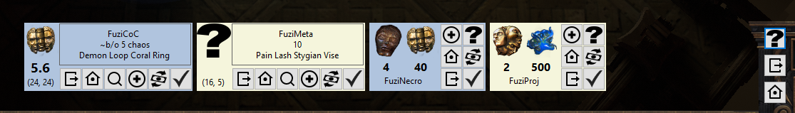

# Current Features (click picture for video)

* Client.txt log monitoring
  * Captures game messages (whispers) 
    * Parses log entries and fires corresponding events to be handled by a broker
    * Broker triggers trade interface/overlay in game
  * Only monitor while game client is open
* Game Client monitoring
  * Game client is open/closed
* In-Game trade interface/overlay
  * Displays incoming/outgoing trade requests
  * Trade interface or the interface elements will differ depending on
    * Trade is incoming/outgoing
    * Previous messages sent
    * Item is available
  * Quick action list - predefined
    * Initiate trade
    * Invite to party
    * Kick from party
    * Thank for trade
    * Check player status (/whois)
* In-Game item overlay
  * Click-through shaded area overlay where item should be located in game

# In Progress

  * Zone based state information for single click functionality
    * (Inviting for trade if in hideout/town vs Asking to wait if not)
* Game Client monitoring
  * Bounds and Location of game client while opened

# (Possible) Future Features / Specs

* Integration with online APIs
  * OAuth authentication
  * Client caching of item database
  * Cataloging of trades
    * ML of trade properties for item evaluation
* Efficiency metrics
  * Time spent per map
  * Currency / Valuables per time spent
* Custom quick actions
* Clipboard monitoring / Mouseover monitoring
  * More advanced tooltips for items (dangerous map mods, T0 affixes, etc)
  * Using clipboard data or item lookup via mouse location (very advanced)